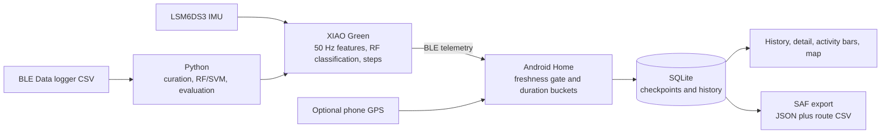

# Home sessions, persistence, and export

The product-facing Home workflow is separate from the research CSV logger on
the Data screen. Green `18EE26A8`, fixed to the left lower leg, is the only
device used by Home. Its saved BLE address is selected explicitly; Home never
connects to the first advertisement with a matching name. Blue remains a
research device for the wrist/leg comparison.

## Responsibility split



The firmware recognizes five activities and counts steps. Android aggregates
class time, estimates calories, stores sessions and optionally records GPS.
Python prepares the research data and evaluates Random Forest and SVM models.

## Time and calorie rules

`ActivityDurationBreakdown` stores milliseconds for `walking`, `running`,
`cycling`, `sitting`, `lying`, and `unknown`. Its total is the exact sum of
those six fields. An interval is assigned to a recognized class only while BLE
is connected and the latest activity telemetry is at most 3 seconds old.
Disconnects and stale telemetry are assigned to `unknown` and add no calories.

The user's mass is frozen when Start is pressed. Calories are recomputed
deterministically from the frozen mass and duration buckets using `MET_v1`:

```text
kcal = sum(MET(activity) * 3.5 * weight_kg / 200 * minutes(activity))
```

MET values are 1.0 lying, 1.3 sitting, 3.5 walking, 6.8 cycling, and 8.0
running. The result is an engineering estimate, not a medical measurement.

## SQLite contract and recovery

`home_sessions` contains the UUID, Active/Completed/Interrupted status, Green
ID, start/end/checkpoint timestamps, frozen mass, six duration buckets, steps,
calories, `MET_v1`, route count, and export state. `home_route_points` contains
ordered timestamp, coordinates, accuracy, and activity values with a cascading
foreign key to the session.

The app performs a transaction checkpoint every 5 seconds and at Stop. Route
points are appended from the last persisted sequence instead of rewriting the
whole route. A stale Active checkpoint cannot overwrite a Completed session.
On process launch, any remaining Active row becomes Interrupted and ends at its
last checkpoint; the app does not pretend that unobserved time was measured.

The internal database is authoritative. A failed final save leaves the result
in memory and exposes Retry. History is retained without an automatic limit.
Manual deletion requires confirmation and does not delete prior exports.

## SAF export

After Stop, the app exports to `home_sessions` below the selected SAF tree:

- `home_yyyyMMdd_HHmmss_<id8>.json` contains the summary, six class times,
  steps, frozen mass, MET values, method and calories;
- `home_yyyyMMdd_HHmmss_<id8>_route.csv` contains
  `timestamp_epoch_ms,latitude,longitude,accuracy_m,activity`.

A session without location permission still gets a route CSV containing only
the header. Files are first written as `.part`, flushed, synchronized and then
renamed. Missing/revoked SAF permission never damages the SQLite copy; choosing
a folder automatically retries non-exported completed/interrupted sessions.

## Screen-lock behavior

The Home foreground service is a connected-device service and adds the
location service type only when location permission exists. Location and
notification permission denial does not block duration, steps or calories.
GPS simply remains absent. Instrumentation Compose tests use a debug-only host
that can render over the lock screen; this removes an unrelated keyguard race
from UI automation. Actual locked-screen session continuity is a separate
foreground-service acceptance test.
